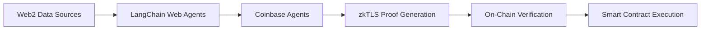

# ZEECA
## ZK & TEE Enabled Enforce Compliance Agent

ZEECA is a blockchain solution that automates the enforcement of Web2 compliance data into Web3 actions. It securely processes sensitive real-world information and executes corresponding on-chain actions while maintaining data privacy.

## 🌟 Features

- **Automated Compliance Bridge**: Converts Web2 legal decisions and private data into automated blockchain actions
- **Privacy-First Architecture**: Combines zkTLS and TEE technology for secure data handling
- **Trustless Verification**: Validates compliance without exposing sensitive information

## 🛠 Tech Stack

- LangChain Web Agents
- Coinbase AgentsSDK
- Phala Network TEE
- zkTLS
- Smart Contracts

## 🏗 Execution Flow

## 🚀 How It Works

1. **Data Discovery & Validation**
   - LangChain Web Agents scan and parse Web2 sources
   - Agents validate data authenticity
   - Results are processed within TEE environment [implementation is not yet complete]

2. **Proof Generation & Verification**
   - Coinbase Agents SDK generates zkTLS proofs
   - Smart contracts verify proofs on-chain

3. **On-Chain Execution**
   - Verified proofs trigger smart contract actions
   - Actions execute based on validated Web2 data

## 💡 Use Cases

- Legal compliance automation
- Private voting enforcement
- Regulatory compliance
- Performance-based crowdfunding execution

## 📄 License

This project is licensed under the MIT License - see the [LICENSE](LICENSE) file for details.
