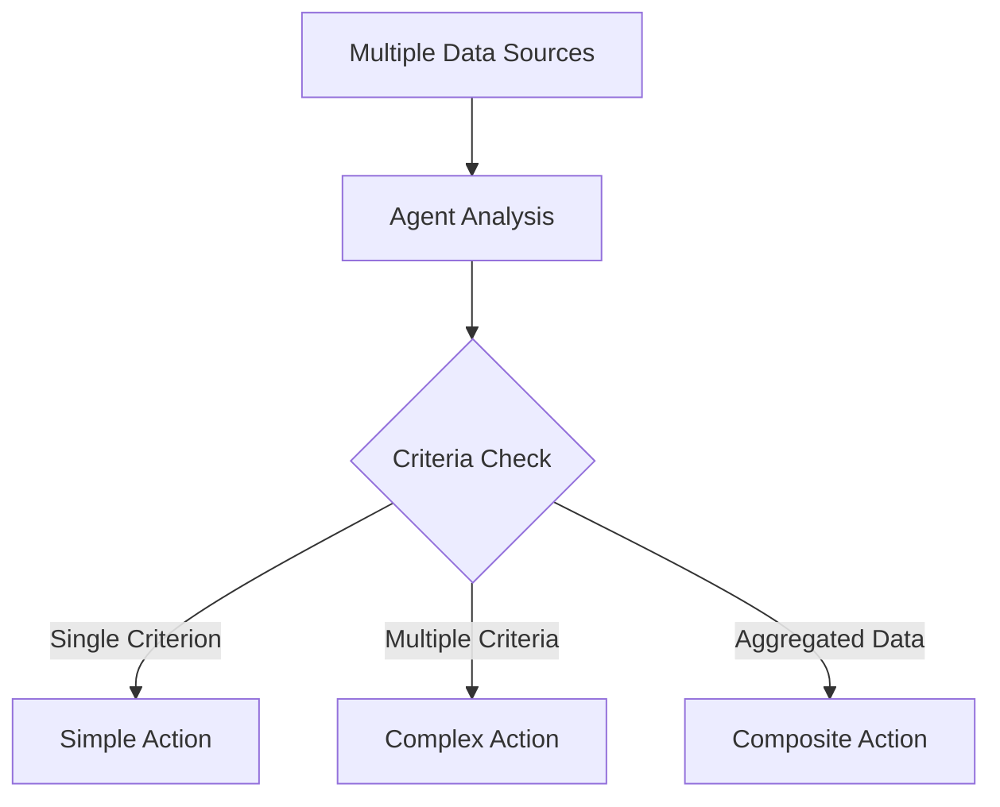

# ZEECA
## ZK & TEE Enabled Enforce Compliance Agent

ZEECA is a blockchain solution that automates the enforcement of Web2 compliance data into Web3 actions. It securely processes sensitive real-world information and executes corresponding on-chain actions while maintaining data privacy.

## 🌟 Features

- **Automated Compliance Bridge**: Converts Web2 legal decisions and private data into automated blockchain actions
- **Privacy-First Architecture**: Combines zkTLS and TEE technology for secure data handling
- **Trustless Verification**: Validates compliance without exposing sensitive information

## 🛠 Tech Stack

- LangChain Web Agents
- Coinbase AgentsSDK
- Phala Network TEE
- zkTLS
- Smart Contracts

## 🏗 Execution Flow


## 🚀 How It Works

1. **Data Discovery & Validation**
   - LangChain Web Agents scan and parse Web2 sources
   - Agents validate data authenticity
   - Results are processed within TEE environment [implementation is not yet complete]

2. **Proof Generation & Verification**
   - Coinbase Agents SDK generates zkTLS proofs
   - Smart contracts verify proofs on-chain

3. **On-Chain Execution**
   - Verified proofs trigger smart contract actions
   - Actions execute based on validated Web2 data

## 💡 Use Cases

- Legal compliance automation
- Private voting enforcement
- Regulatory compliance
- Performance-based crowdfunding execution


## 🔧 Installation & Setup

### Prerequisites
- Python 3.10+
- [CDP API Key](https://portal.cdp.coinbase.com/access/api)
- [OpenAI API Key](https://platform.openai.com/docs/quickstart#create-and-export-an-api-key)
- Poetry package manager

### 1. Set Environment Variables
Configure the following environment variables required for Coinbase AgentKit:

- Ensure the following ENV Vars are set:
  - "CDP_API_KEY_NAME=<your-cdp-api-key-name>"
  - "CDP_API_KEY_PRIVATE_KEY=<your-cdp-api-key-private-key>"
  - "OPENAI_API_KEY=<your-openai-api-key>"
  - "NETWORK_ID=base-sepolia"

### 2. Navigate to Project Directory

```bash
cd cdp-agentkit/cdp-langchain/examples/zeeca
poetry install
poetry run python zeeca.py
```

## Example Task

The agents performs an automated analysis of election results and takes actions based on the outcome. The process involves:

1. Election Results Analysis
   - Analyze CNN's election results page
   - Report vote counts, state results, and electoral distribution

2. Party-Specific Analysis
   - If Republicans lead: Analyze GOP website
   - If Democrats lead: Analyze Democratic party website
   - If unclear: Check Politico for expert analysis

3. Post-Victory Actions (if Republican victory)
   - Request test funds from faucet
   - Generate and verify zkTls proof
   - Mint commemorative NFT
   - Provide transaction details

The agents should provide detailed observations, reasoning, and outcomes for each step in markdown format, while avoiding direct content reproduction from source URLs.

See [ZECA Results of the Task](./cdp-agentkit/cdp-langchain/examples/zeeca/README.md) for more details.

## ZEECA Applications

### 🤖 Agent Capabilities
ZEECA agents can aggregate multiple data points and execute actions based on single or combined criteria. Agents continuously monitor, validate, and execute actions when predefined conditions are met.

### 🔄 Automated Actions Based On:

1. **Single Criterion**
2. **Multiple Criteria**
3. **Aggregated Data**

**Example Multi-Criteria Triggers:**


### Examples of ZEECA Applications

### Legal & Compliance
- 🏛️ Court Order Enforcement
  - Automatic asset freezing based on court decisions
  - Enforcement of settlement distributions
  - Legal document verification and enforcement

- 📜 Regulatory Compliance
  - Regulatory reporting automation
  - License validity verification
  - Compliance certificate enforcement

### Voting & Governance
- 🗳️ Voiting Results
  - DAO proposal execution based on offchain voting results
  - Automated dividend distribution based on offchain voting results
  - Community fund allocation enforcement

- 🤝 Corporate Governance
  - Board decision implementation
  - Shareholder resolution enforcement
  - Merger/acquisition execution based on offchain voting results
  - Executive compensation distribution

### Finance & Payments
- 💰 Performance-Based Payments
  - Milestone-based fund release
  - Escrow automation based on delivery confirmation
  - Bounty distribution upon task completion
  - Revenue sharing based on performance metrics

- 🏦 Financial Services
  - Loan disbursement based on credit verification
  - Insurance claim processing and payout
  - Debt collection enforcement
  - Dividend distribution automation

and many many others


## 📄 License

This project is licensed under the MIT License - see the [LICENSE](LICENSE) file for details.

MIT License

Copyright (c) 2024 ZEECA

Permission is hereby granted, free of charge, to any person obtaining a copy
of this software and associated documentation files (the "Software"), to deal
in the Software without restriction, including without limitation the rights
to use, copy, modify, merge, publish, distribute, sublicense, and/or sell
copies of the Software, and to permit persons to whom the Software is
furnished to do so, subject to the following conditions:

The above copyright notice and this permission notice shall be included in all
copies or substantial portions of the Software.

THE SOFTWARE IS PROVIDED "AS IS", WITHOUT WARRANTY OF ANY KIND, EXPRESS OR
IMPLIED, INCLUDING BUT NOT LIMITED TO THE WARRANTIES OF MERCHANTABILITY,
FITNESS FOR A PARTICULAR PURPOSE AND NONINFRINGEMENT. IN NO EVENT SHALL THE
AUTHORS OR COPYRIGHT HOLDERS BE LIABLE FOR ANY CLAIM, DAMAGES OR OTHER
LIABILITY, WHETHER IN AN ACTION OF CONTRACT, TORT OR OTHERWISE, ARISING FROM,
OUT OF OR IN CONNECTION WITH THE SOFTWARE OR THE USE OR OTHER DEALINGS IN THE
SOFTWARE.
